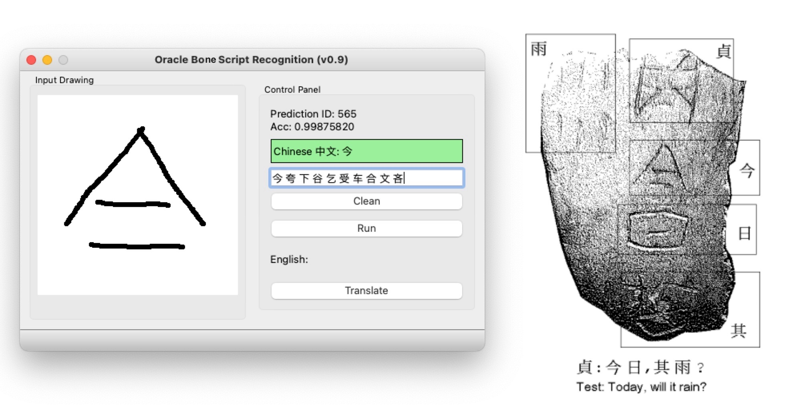
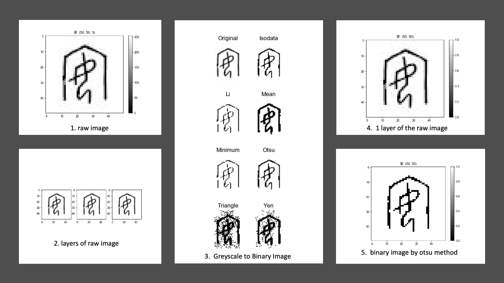
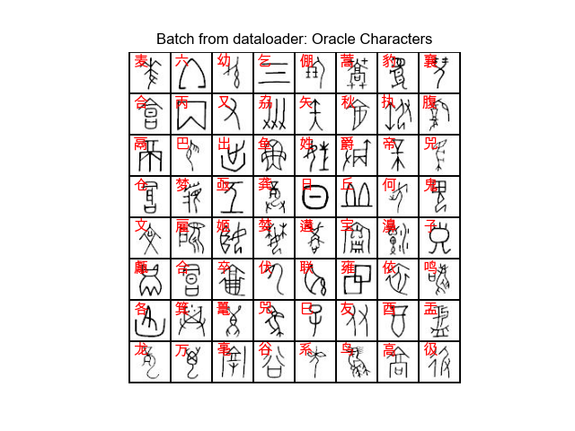
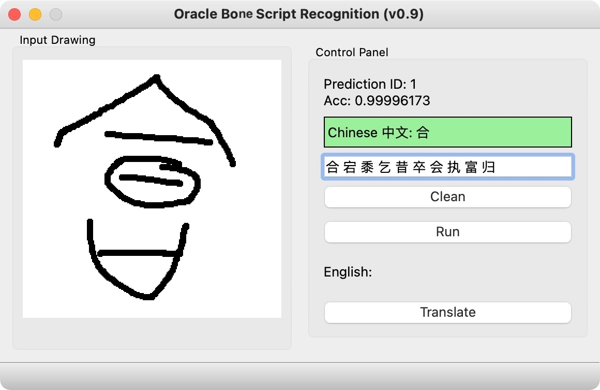

# Oracle-Bone-Script-Recognition: Step by Step Demo

==============================

## 1. Project Background

A short description of the project. This Repository will demonstrate using Pytorch to build deep convolutional neural networks and use Qt to create the GUI with the pre-trained model like the figure below.



## 2. Basic Requirments

I used [cookiecutter](https://drivendata.github.io/cookiecutter-data-science/) package to generate a skeleton of the project.

There are some opinions implicit in the project structure that have grown out of our experience with what works and what doesn't when collaborating on data science projects. Some of the opinions are about workflows, and some of the opinions are about tools that make life easier.

- Data is immutable
- Notebooks are for exploration and communication (not for production)
- Analysis is a DAG (I used the 'Makefile' workflow)
- Build from the environment up

### Starting Requirements

- conda 4.12.0
- Python 3.7, 3.8
I would suggest using [Anaconda](https://www.anaconda.com/) for the installation of Python. Or you can just install the [miniconda](https://docs.conda.io/en/latest/miniconda.html) package which save a lot of space on your hard drive.

## 3. Tutorial Step by Step

### Step 1: Init the project

Use 'git' command to clone the project from the Github.

```bash
cd PROJECT_DIR
git clone https://github.com/cuicaihao/deep-learning-for-oracle-bone-script-recognition 
# or
# gh repo clone cuicaihao/deep-learning-for-oracle-bone-script-recognition
```

Check the project structure.

```bash
cd deep-learning-for-oracle-bone-script-recognition
ls -l
# or 
# tree -h
```

You will see an similar structure as the one shown in the end.  Meanwhile you could open the 'Makefile' to see the raw commands of the workflow.

- [Makefile](Makefile)

### Step 2: Create the Python Environment and Install the Dependencies

The default setting is to create virtual environment with Python 3.8.

```bash
make create_environment
```

Then, we activate the virtual environment.

```bash
conda activate oracle-bone-script-recognition
```

Then, we install the dependencies.

```bash
make requirements
```

The details of the dependencies are listed in the 'requirements.txt' file.

- [requirements.txt](requirements.txt)

### Step 3: Download the Raw Data and Preprocess the Data

Now thanks to the [甲骨文](https://github.com/Chinese-Traditional-Culture/JiaGuWen),


we can download the raw data of the images and database of oracle bone script.
Then we will download the raw data and preprocess the data in the project `data/raw` directory.

```bash
make download_data
```

The basic step is to download repo, unzip the repo, and then make cp of the images and database (JSON) file to the project `data/raw` directory.

Then, we preprocess the data, to create a table (csv file) for model development.

```bash
make create_dataset
```

The source code is located at `src/data/make_dataset.py`. The `make` command will provide the input arguments to this script to  create two tables (csv file) in the project `data/processed` directory.

- [src/data/make_dataset.py](src/data/make_dataset.py)
- [processed/image_name_label.csv](data/processed/image_name_label.csv)
- [processed/label_name.csv](data/processed/label_name.csv)

### Step 4: Build the Model with Pytorch  

This section is about the model development.

#### 4.1 Review Image and DataLoader

Before we build the model, we need to review the image and data loader.

```bash
make image_review
```

This step will generate a series of images of the oracle bone script image sample to highlight the features of the images, such as color, height, width. Besides, we show the results of different binarization methods of the original greyscale image with the tool provided by the `scikit-image` package.

The source code is located at `src/visualization/visualize.py`.

- [src/visualization/visualize.py](src/visualization/visualize.py)



- [How to apply a threshold?](https://scikit-image.org/docs/stable/auto_examples/applications/plot_thresholding.html)
- [https://scikit-image.org/](https://scikit-image.org/)

#### 4.2 Test the DataLoader

We can still test the Dataloader with the command.

```bash
make test_dataloader
```

This will generate an 8x8 grid-image of the oracle bone script image sample. The source code is located at `src/data/make_dataloader.py`.

- [src/data/make_dataloader.py](src/data/make_dataloader.py)

In the image below, it generates a batch of 64 images with its label(Chinese characters) on the top-left corner.



#### 4.3 Build the Deep Convolutional Neural Networks Model

Now we can build the model.
The souce code is loacted at `src/models/train_model.py`.
This command will generate the model and the training process records at `models/`.

```bash
make train_model
```

**(Optional)** One can monitor the process by using the `tensorboard` command.

```bash
# Open another terminal
tensorboard --logdir=models/runs
```

Then open the link: <http://localhost:6006/> to monitor the training and validation losses, see the training batch images, and see the model graph.


- [src/models/train_model.py](src/models/train_model.py)

After the training process, there is one model file named `model_best` in the `models/` directory.

#### 4.4 Test the Model with Sample Image

The pretrained model is located at `models/model_best`. We can test the model with the sample image. I used the  image (3653610.jpg) of the oracle bone script dataset in the `Makefile` `test_model` scripts, readers can change it to other images.

```bash
make test_model
# ...
# Chinese Character Label = 安
#      label name  count       prob
# 151    151    安      3 1.00000000
# 306    306    富      2 0.01444918
# 357    357    因      2 0.00002721
# 380    380    家      2 0.00001558
# 43      43    宜      5 0.00001120
# 586    586    会      1 0.00000136
# 311    311    膏      2 0.00000134
# 5        5    执      9 0.00000031
# 354    354    鲧      2 0.00000026
# 706    706    室      1 0.00000011
```

The command will generate a sample figure with a predicted label on the top, and a table with the top 10 predicted labels sorted by the probability.


### Step 5: Test the Model with Qt-GUI

Now we have the model, we can test the model with the Qt-GUI. I used the [Qt Designer](https://build-system.fman.io/qt-designer-download) to create the UI file at `src/ui/obs_gui.ui`. Then, use the `pyside6-uic` command to get the Python code from the UI file `pyside6-uic src/ui/obs_gui.ui -o src/ui/obs_gui.py.

Activate the GUI by

```bash
python gui.py
# or 
# make test_gui
```



The GUI contains an input drawing window for user to scratch the oracle bone script as an image.  
After the user finishes the drawing and clicks the RUN button. The input image is converted to a tensor (np.array) and fed into the model. The model will predict the label of the input image with probability which is shown on the top  `Control Panel` of the GUI.

- Text Label 1: Show the Chinese character label of the input image ID and the Prediction Probability. If the Acc > 0.5, the label background color is green, if the Acc < 0.0001 the label background color is red, otherwise the label background color is yellow.

- Test Label 2: Show the top 10 predicted labels sorted by the probability.
- **Clean** Button: Clean the input image.
- **Run** Button: Run the model with the input image.
- **Translate** Button: (Optional) Translate the Chinese character label to English. I did not find a good Translation service for single character, so I left this park for future development or the readers to think about it.

===================================

## 4 Summary

This repository is inspired by the most recent DeepMind's work [Predicting the past with Ithaca](https://www.deepmind.com/blog/predicting-the-past-with-ithaca), I did not dig into the details of the work due to limited resources.

I think the work is very interesting and I want to share my experience with the readers by trying a different language like Oracle Bone Scripts. It is also a good starter example for myself to revisit the pytorch deep learning packages and the qt-gui toolboxes.

I will be very grateful if you can share your experience with more readers. If you like this repository, please upvote/star it.

If you find the repository useful, please consider donating to the Standford Rural Area Education Program (<https://sccei.fsi.stanford.edu/reap/>): Policy change and research to help China's invisible poor.

Thank you.

## License

The MIT License (MIT), Copyright (c) 2022, Caihao Cui

## Planning Tasks

- [ ] Enhance the data sample with image transform operations to make the model robust to various input, e.g., rotate image with [-15,15] degrees.
- [ ] Upgrade the ConvNet model and find better solutions (model structure, loss function, etc).
- [ ] Upgrade the Chinese-to-English translator, maybe built a Transformer model to translate sentence from chinese to english; Feel free to check my early work on blog [the-annotated-transformer-english-to-chinese-translator](https://cuicaihao.com/the-annotated-transformer-english-to-chinese-translator/).
- [ ] Upgrade the Input drawing,  adding features of OCR and Character Detection function allow use scanning the large image.

## Project Organization

------------

    ├── LICENSE
    ├── Makefile           <- Makefile with commands like `make data` or `make train`
    ├── README.md          <- The top-level README for developers using this project.
    ├── data
    │   ├── external       <- Data from third party sources.
    │   ├── interim        <- Intermediate data that has been transformed.
    │   ├── processed      <- The final, canonical data sets for modeling.
    │   └── raw            <- The original, immutable data dump.
    │
    ├── docs               <- A default Sphinx project; see sphinx-doc.org for details
    │
    ├── models             <- Trained and serialized models, model predictions, or model summaries
    │
    ├── notebooks          <- Jupyter notebooks. Naming convention is a number (for ordering),
    │                         the creator's initials, and a short `-` delimited description, e.g.
    │                         `1.0-jqp-initial-data-exploration`.
    │
    ├── references         <- Data dictionaries, manuals, and all other explanatory materials.
    │
    ├── reports            <- Generated analysis as HTML, PDF, LaTeX, etc.
    │   └── figures        <- Generated graphics and figures to be used in reporting
    │
    ├── requirements.txt   <- The requirements file for reproducing the analysis environment, e.g.
    │                         generated with `pip freeze > requirements.txt`
    │
    ├── setup.py           <- makes project pip installable (pip install -e .) so src can be imported
    ├── src                <- Source code for use in this project.
    │   ├── __init__.py    <- Makes src a Python module
    │   │
    │   ├── data           <- Scripts to download or generate data
    │   │   └── make_dataset.py
    │   │
    │   ├── features       <- Scripts to turn raw data into features for modeling
    │   │   └── build_features.py
    │   │
    │   ├── models         <- Scripts to train models and then use trained models to make
    │   │   │                 predictions
    │   │   ├── predict_model.py
    │   │   └── train_model.py
    │   │
    │   └── visualization  <- Scripts to create exploratory and results oriented visualizations
    │       └── visualize.py
    │
    └── tox.ini            <- tox file with settings for running tox; see tox.readthedocs.io

--------

### Reference

- [Cookiecutter Data Science](https://drivendata.github.io/cookiecutter-data-science/)
- [PyTorch Tutorial](https://pytorch.org/tutorials/beginner/basics/quickstart_tutorial.html)
- [Qt for Python](https://wiki.qt.io/Qt_for_Python)
- [Chinese-Traditional-Culture/JiaGuWen](https://github.com/Chinese-Traditional-Culture/JiaGuWen)
- [Website of the Oracle Bone Script Index](https://chinese-traditional-culture.github.io/JiaGuWen/)

<p><small>Project based on the <a target="_blank" href="https://drivendata.github.io/cookiecutter-data-science/">cookiecutter data science project template</a>. #cookiecutterdatascience</small></p>
